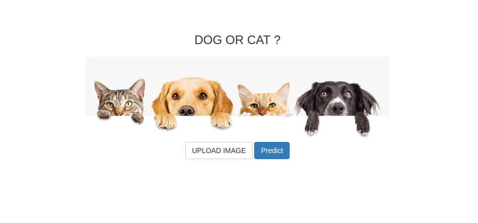
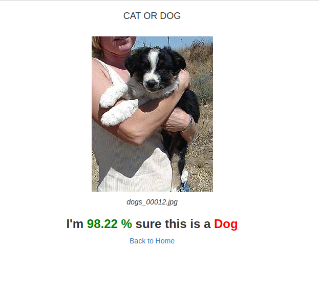

# Dog or Cat

[Play with the App](https://dogorcat.herokuapp.com/)

A simple Flask App that can classify an image as Dog or Cat
using a convolutional neural network model. 

## Tools Used:
* Tensorflow
* Keras
* h5py
* Flask
* Bootstrap
* Heroku

### Credit

Credit to this 2 repository I used to build this. Special
credit to @LukaszMalucha 

